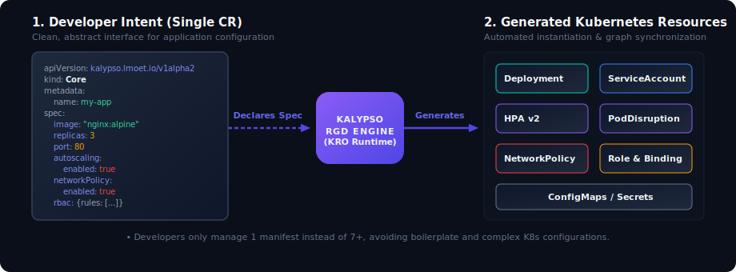

# Kalypso

A series of high-level, opinionated Custom Resources for Kubernetes-based Platforms, powered by [KRO](https://kro.run) (Kube Resource Operator).


Kalypso provides platform engineers and developers with ready-to-use building blocks—called **Capabilities**—which aggregate standard, low-level Kubernetes resources into clean, simplified interfaces.

---

## Features (v1alpha2 Release)

The `v1alpha2` release implements the **Compute** capability, offering the following features:
* **Exclusive Workloads**: Single interface supporting `Deployment`, `StatefulSet`, or `DaemonSet` through a `spec.workloadType` selector.
* **Autoscaling**: Automated and native integration with `HorizontalPodAutoscaler` (HPA v2).
* **High Availability**: Built-in, default topology spread constraints (spreading across hostnames) and customizable `PodDisruptionBudget` (PDB) supports.
* **Secret & ConfigMap Binding**: Seamless mounting of configuration and credentials as container environment variables (`envFrom`).
* **Declarative Security**: Conditional creation of Kubernetes `NetworkPolicy` and namespaced/cluster-scoped RBAC `Role` / `ClusterRole` permissions automatically bound to the workload.

---

## How Kalypso Works

Kalypso abstracts multi-resource deployments by providing a simple, high-level developer spec that automatically generates, binds, and manages a complete set of underlying Kubernetes resources.



---

## List of Resource Graph Definitions (RGDs)

| RGD Name | Kind | API Version | Scope | Description |
| --- | --- | --- | --- | --- |
| **Compute** | `Compute` | `kalypso.lmoet.io/v1alpha2` | Namespaced | User-facing API for defining and running application workloads and associated operational addons. |
| **PodSpec** | `PodSpec` | `kalypso.lmoet.io/v1alpha2` | Namespaced | *Internal* type chained by `Compute` to resolve container environments, probes, resource bounds, and scheduling settings. |

*Note: For v1alpha1 versions of these RGDs, refer to the files under `capabilities/compute/v1alpha1/`.*

---

## Quick Example: Using `Compute`

Here is a minimal deployment example using the `Compute` RGD:

```yaml
apiVersion: kalypso.lmoet.io/v1alpha2
kind: Compute
metadata:
  name: hello-kalypso
  namespace: default
spec:
  image: gcr.io/google-samples/hello-app:1.0
  port: 8080
  replicas: 2
```

This single manifest triggers KRO to automatically generate:
1. A **Deployment** running 2 replicas of the hello-app container.
2. A **ServiceAccount** configured with name `hello-kalypso` and mounted on the pods.
3. A **PodDisruptionBudget** ensuring at most 1 replica is unavailable at a time.

For more advanced configurations (including RBAC, NetworkPolicies, StatefulSets, and Autoscaling), check the **[Extensive Documentation Guide](file:///Users/miguel.santos/Projects/personal/kalypso/docs/README.md)**.

---

## Kubernetes Compatibility Matrix

Kalypso requires Kubernetes versions with stable Common Expression Language (CEL) validation in Custom Resource Definitions.

| Kubernetes Version | Support Status | Notes |
| --- | --- | --- |
| **v1.32.x** | **Fully Compatible** | Tested in our E2E framework suite (`kindest/node:v1.32.2`). |
| **v1.31.x** | **Compatible** | Recommended, matches KRO v0.9.x features. |
| **v1.30.x** | **Compatible** | Recommended, matches KRO v0.9.x features. |
| **v1.29.x** | **Compatible** | Minimum recommended version for stable CEL support. |
| **&lt;= v1.28.x** | **Not Recommended** | Older CEL feature gates might result in schema compilation errors. |

---

## Getting Started

1. **Deploy KRO**:
   Install Kube Resource Operator (v0.9.2 or higher) in your cluster.
2. **Apply Kalypso RGDs**:
   ```bash
   kubectl apply -f capabilities/compute/v1alpha2/podspec-rgd.yaml
   kubectl apply -f capabilities/compute/v1alpha2/compute-rgd.yaml
   ```
3. **Deploy Workloads**:
   Apply your `Compute` custom resources!
